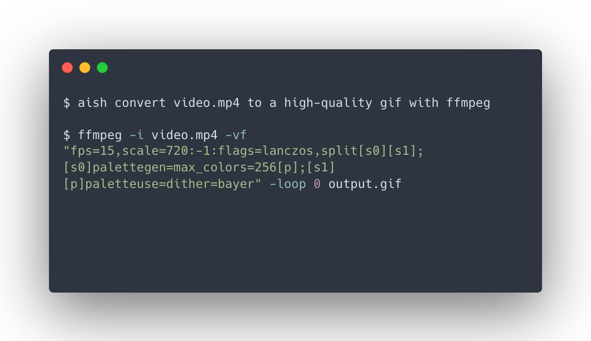

# aish — AI Shell Command Generator

Translates natural language into shell commands. Type `aish <description>`, and the generated command is placed on your prompt line for review before executing.



## Requirements

- `curl`
- `jq`

## Getting started

Download the script:

```bash
curl -o ~/aish.sh https://raw.githubusercontent.com/circleci-petri/aish/main/aish.sh
```

Pick a provider and add the corresponding block to your `~/.zshrc` or `~/.bashrc`, then run `source ~/.zshrc` (or `~/.bashrc`).

**Anthropic** (default model: `claude-sonnet-4-6`)

```bash
export AISH_PROVIDER=anthropic
export ANTHROPIC_API_KEY=sk-ant-...
source ~/aish.sh
```

**OpenAI** (default model: `gpt-5-mini`)

```bash
export AISH_PROVIDER=openai
export OPENAI_API_KEY=sk-...
source ~/aish.sh
```

**Ollama** (model is required — set it to any model you have pulled)

```bash
export AISH_PROVIDER=ollama
export AISH_MODEL=llama3
export AISH_OLLAMA_URL=http://localhost:11434  # optional, this is the default
source ~/aish.sh
```

To override the model for Anthropic or OpenAI, add `export AISH_MODEL=<model>` before the `source` line.

## Usage

```bash
aish list files in the current directory
aish find processes using port 3000
aish compress all pngs in this folder
aish show disk usage sorted by size
```

In **zsh**, the generated command is placed directly on your prompt line — edit it or press Enter to run.

In **bash**, the command is printed and added to history — press Up to edit and run.
